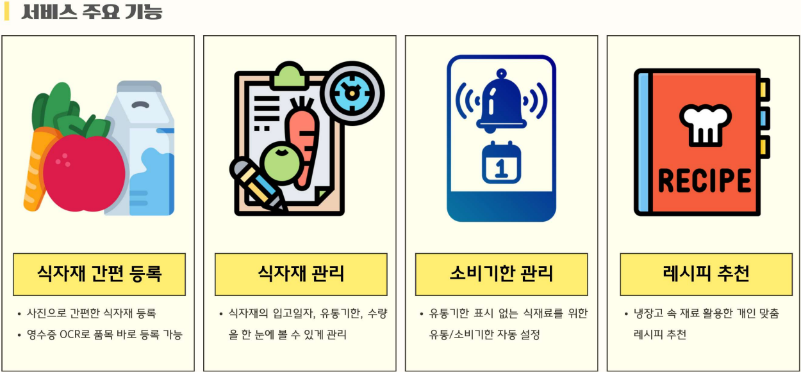
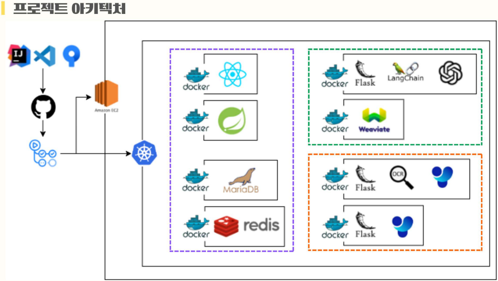
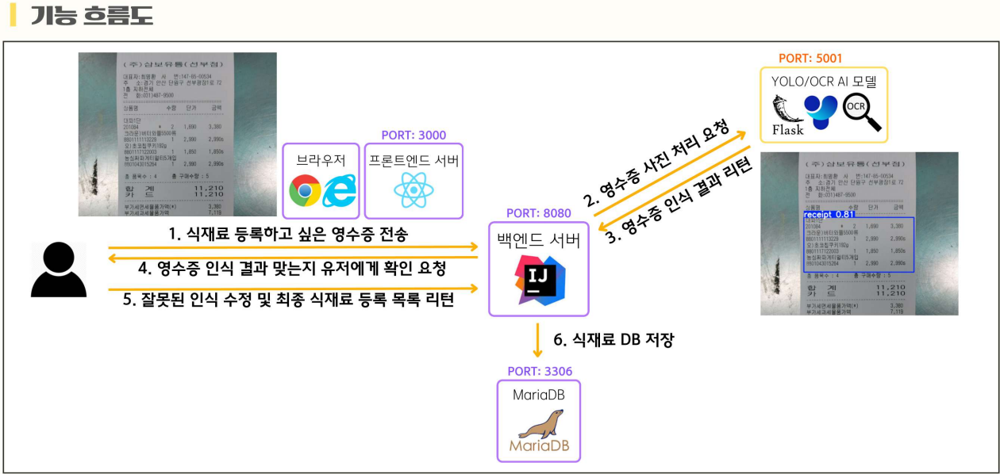
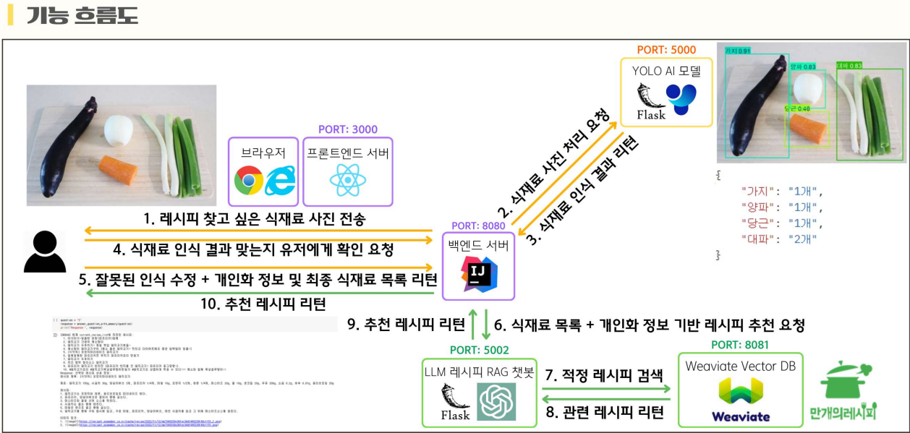
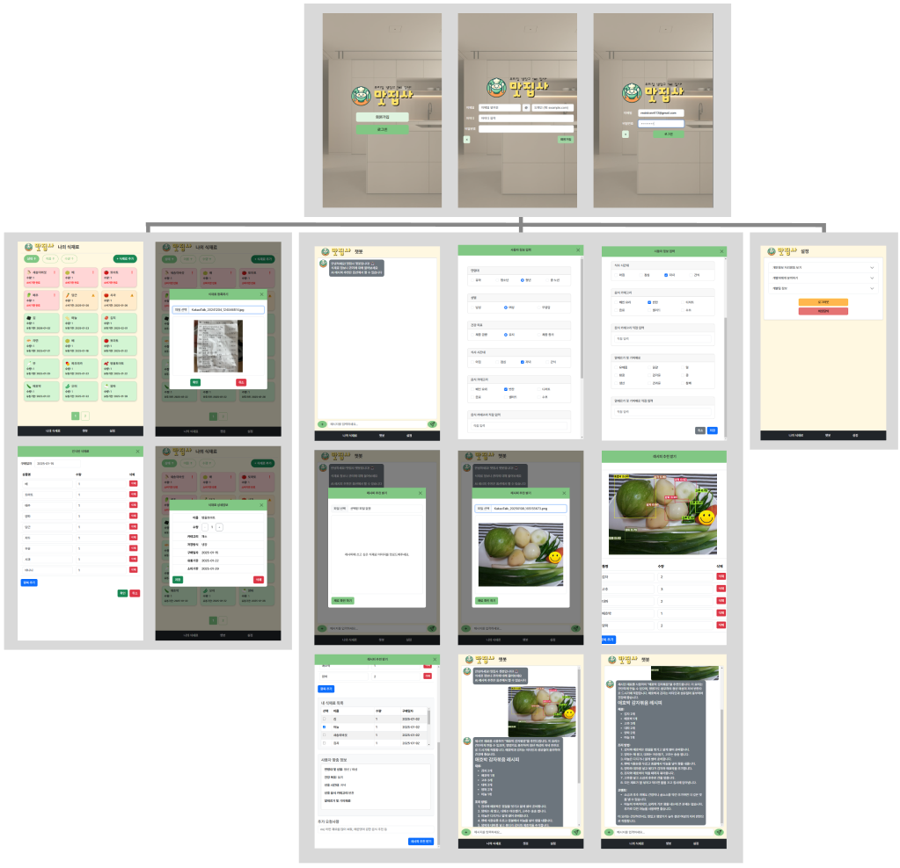

# 맛집사 (식재료 관리 및 AI 레시피 제공 서비스)

**맛집사**는 AI 기술을 활용해 사용자의 냉장고 속 식재료를 효율적으로 관리하고, 개인 맞춤형 레시피를 제공하는 서비스입니다.

[시연영상](https://www.youtube.com/watch?v=-Av54X0X0R0)
---

## 📋 **프로젝트 개요**

### **프로젝트 기간**
2024년 10월 28일 ~ 2025년 1월 16일

### **주요 기능**

1. **식재료 관리**
   - **영수증 OCR 인식**: 영수증 이미지에서 구매한 식재료, 구매일자를 인식하여 등록 자동화
   - **유통/소비기한 알림**: 식재료 DB를 통한 유통/소비기한 관리로 낭비 최소화

2. **AI 기반 맞춤형 레시피 추천**
   - YOLO 모델을 활용한 식재료 이미지 인식
   - 사용자가 보유한 식재료와 개인 취향을 반영한 프롬프트 생성
   - OpenAI API에 **검색 증강 생성(RAG)** 기법을 활용하여, 사용자의 재료와 요구에 맞춘 레시피 추천

---

## 📊 프로젝트 아키텍처

- 마이크로서비스 기반으로 설계한 아키텍처
- **GitHub Actions**를 통해 CI/CD 자동화

---

## 🛠 **기술 스택**

### **프론트엔드**
- React, TypeScript, React Router, Axios

### **백엔드**
- Java, Spring Boot, JPA, Spring Security

### **데이터베이스**
- MariaDB, Redis, Weaviate(Vector Database)

### **인공지능**
- **YOLOv5**
- **Tesseract OCR**
- **OpenAI API + RAG**

### **DevOps**
- Docker, Kubernetes
- GitHub Actions

---

## 🚀 **서비스 흐름**

1. **사용자 정보 등록**
   - 사용자가 영수증을 업로드하거나 직접 입력으로 식재료 등록
   - 레시피 추천에 필요한 사용자 맞춤 정보 입력

2. **레시피 추천**
   - Weaviate 데이터베이스로 레시피 유사도 검색 수행
   - 사용자의 식재료 데이터를 기반으로 GPT API를 활용하여 개인화된 레시피를 제공
   - 
3. **결과 제공**
   - 추천된 레시피와 부족한 식재료 등을 사용자에게 제공

---

## 📜 **API 명세**
### 1. 사용자

| 1레벨 | 2레벨                 | 3레벨                                | HTTP method | URI                                |
|-------|------------------------|---------------------------------------|-------------|------------------------------------|
| 회원  | 인증                  | 회원가입                             | POST        | /api/auth/register                |
|       |                        | 로그인                               | POST        | /api/auth/authenticate            |
|       |                        | 로그아웃                             | POST        | /api/auth/logout                  |
|       |                        | 회원탈퇴                             | DELETE      | /api/auth/account                 |
|       |                        | 토큰 갱신                            | POST        | /api/auth/token/refresh           |
| 기능  | 사용자 식재료 관리    | 영수증 인식(OCR)으로 식재료 등록     | POST        | /api/ingredients/receipts         |
|       |                        | 직접 식재료 등록                     | POST        | /api/ingredients/manual           |
|       |                        | 식재료 조회                          | GET         | /api/ingredients                  |
|       |                        | 식재료 삭제                          | DELETE      | /api/ingredients/{orderItemId}    |
|       |                        | 식재료 수량 수정                     | PUT         | /api/ingredients/{orderItemId}    |
|       | 챗봇                  | 레시피 RAG 챗봇 질의                 | POST        | /api/chat/recipes/questions       |
|       |                        | 모든 메세지 조회                     | GET         | /api/chat/messages                |
|       |                        | 모든 메세지 삭제                     | DELETE      | /api/chat/messages                |
|       |                        | GPT 챗봇 질의                        | POST        | /api/chat/general/questions       |
|       | 이미지 인식           | 식재료 사진 인식                     | POST        | /api/items/detection              |
|       |                        | 영수증 OCR 인식                      | POST        | /api/receipts                     |

### 2. 관리자

| 1레벨 | 2레벨          | 3레벨                | HTTP method | URI                                |
|-------|-----------------|----------------------|-------------|------------------------------------|
| 회원  | 회원 관리       | 전체 회원 조회       | GET         | /api/users                        |
|       |                 | 회원 삭제           | DELETE      | /api/users/{id}                   |
| 기능  | 카테고리 관리   | 모든 카테고리 조회   | GET         | /api/items/categories             |
|       |                 | 카테고리 등록       | POST        | /api/items/categories             |
|       |                 | 카테고리 삭제       | DELETE      | /api/items/categories/{id}        |
|       | 보관방법 관리   | 모든 보관방법 조회   | GET         | /api/items/storage-methods        |
|       |                 | 보관방법 등록       | POST        | /api/items/storage-methods        |
|       |                 | 보관방법 삭제       | DELETE      | /api/items/storage-methods/{id}   |
|       | 식재료 관리     | 기본 식재료 등록     | POST        | /api/items                        |
|       |                 | 모든 식재료 조회     | GET         | /api/items                        |
|       |                 | 기본 식재료 삭제     | DELETE      | /api/items/{id}                   |

---

## 👨‍👩‍👧‍👦 **팀 구성**
- **프로젝트 매니저 및 프론트엔드 개발**: 서진석
- **백엔드 개발**: 한서연
- **이미지 AI 엔지니어**: 장선아, 허정모
- **언어 AI 엔지니어**: 강구성, 강민기

---

이 프로젝트는 **현대로템 K-방산 AI모델 개발과정 1기**에서 진행되었습니다.

